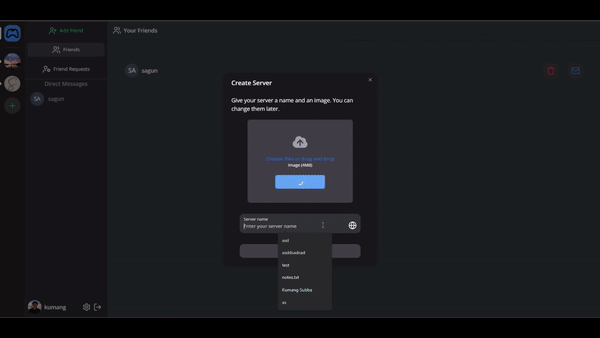

## Fullstack Discord clone: NextCord

Developed using Next.Js, NextAuth, React, Prisma, MySQL, Socket.IO, LiveKit, Tailwind, NextUI, TypeScript

[Demo](https://nextcord.onrender.com/)

Features:

- User Registration and Authentication with NextAuth
- ORM using Prisma
- MySQL database using PlanetScale
- UI using combination of ShadcnUI, Tailwind, and NextUI
- Send, accept, or reject friend requests
- Real-time chat using Socket.IO
- Upload images using UploadThing
- Delete & Edit messages in real time for any chat
- Create and customize your own server
- Member management in the server
- Unique invite link for every server
- Create Text, Audio, and Video channels
- Audio and Video calls using LiveKit
- Full responsivity and mobile UI
